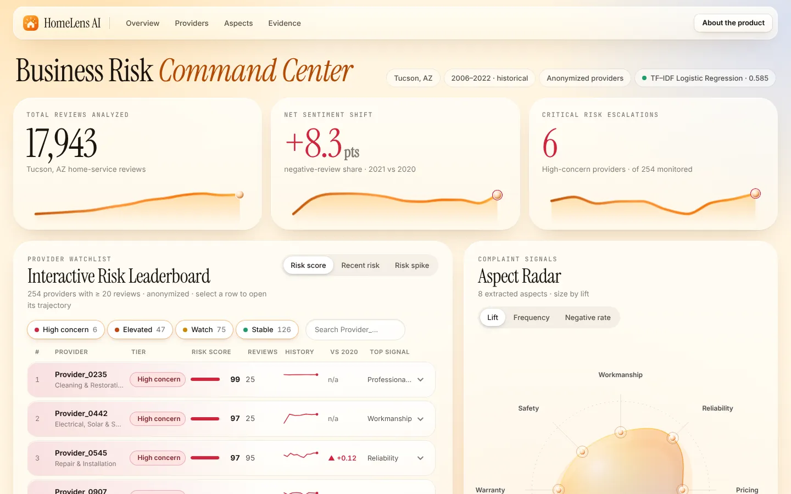
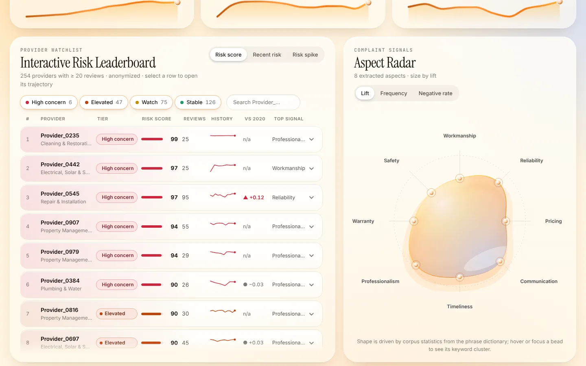
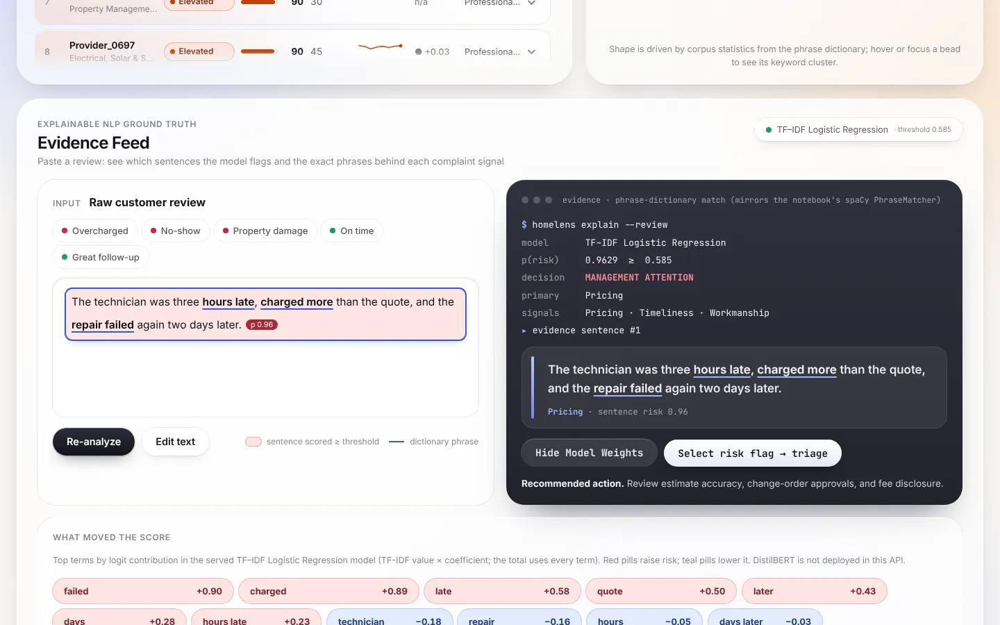
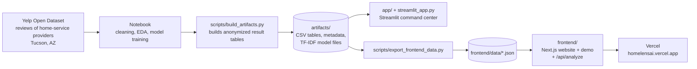

# HomeLens AI

**Turning customer reviews of home-service providers into early-warning signals a manager can act on.**

CIS 509 · Analytics for Unstructured Data · Final course project
Team: Rithik Roy Thati · Kanha Jodhpurkar · Sankalp Sharma Madgula · Dev Bhattacharyya

**Live demo: <https://homelensai.vercel.app>** (public, no sign-up; try the analyzer on the home page, then open the full command center at `/demo`)



---

## 1. Start here (a 5-minute tour for a reviewer)

| If you want to… | Open this | Time |
|---|---|---|
| See the finished product | **<https://homelensai.vercel.app>**, then click *Open the live demo* | 2 min |
| Read the analysis, methods and results | [`notebooks/FinalProject_HomeLensAI.ipynb`](notebooks/FinalProject_HomeLensAI.ipynb) (executed, outputs visible) | 15 min |
| See the exploratory data analysis (Milestone 2) | [`notebooks/ProjectEDA_HomeLensAI.ipynb`](notebooks/ProjectEDA_HomeLensAI.ipynb) or the HTML export next to it | 10 min |
| Understand how the pieces connect | Section 4 below, then [`docs/DATA_CONTRACT.md`](docs/DATA_CONTRACT.md) | 5 min |
| Check the code is tested | `make test-py` (27 Python tests) and `make test` (14 website tests), also run automatically by GitHub Actions on every push | 1 min |
| See where each grading criterion is addressed | Section 9 below | 2 min |

---

## 2. The problem, in plain English

A star rating tells you a customer was unhappy. It does **not** tell you *why*, *whether it keeps happening*, or *what to do about it*. A plumbing or HVAC company with a handful of one-star reviews might have a real operational problem (no-shows, surprise fees, repeat repairs) or just a few bad days. Managers cannot read thousands of reviews to find out.

**HomeLens AI reads the review text and answers three questions:**

| # | Question | How we answer it |
|---|---|---|
| 1 | **Is this review a risk signal?** | A model scores each review. We tested three: a word-list baseline (TextBlob), TF-IDF + logistic regression, and a fine-tuned DistilBERT transformer. |
| 2 | **What exactly went wrong, and what is the proof?** | A phrase dictionary over **8 complaint aspects** (workmanship, reliability/no-show, pricing, communication, timeliness, professionalism, warranty, safety) finds the complaint and highlights the **evidence sentence**. |
| 3 | **Does it keep happening at this provider, and what should the manager do?** | Reviews roll up to provider-level scores, yearly trends and four **relative concern tiers** (Stable, Watch, Elevated, High concern), each with a recommended action. |

### A real example (output of the running system)

> *"The technician was three hours late, charged more than the quote, and the repair failed again two days later."*

| Output | Value |
|---|---|
| Risk score | **0.96** (the alert threshold is 0.585) → **Management attention** |
| Complaint aspects found | Pricing, Timeliness, Workmanship |
| Evidence phrases highlighted | "hours late", "charged more", "repair failed" |
| Recommended action | "Review estimate accuracy, change-order approvals, and fee disclosure." |

You can reproduce this yourself on the home page of the live demo.

### Important: signals, not verdicts
Reviews are unverified customer **allegations**. The system produces *review-based risk signals for human investigation*. It never claims fraud, legal liability, verified misconduct, verified safety violations, or bankruptcy/financial-failure prediction. See [Section 8](#8-responsible-ai-and-limits).

---

## 3. What the product looks like

| Provider monitoring | Explainable evidence |
|---|---|
|  |  |
| 254 anonymized providers ranked by relative risk, with tier, trend and a yearly trajectory per provider. | The flagged sentence, the matched phrases and the words that moved the score. |

The same analysis is available in two interfaces built on the same data:
* **The website + live demo** (`frontend/`, Next.js on Vercel): marketing pages (product, methodology, pricing notes, Responsible AI, docs, FAQ, legal) and the full command center at `/demo`.
* **The Streamlit app** (`streamlit_app.py`): five analyst pages (Executive Overview, Review Analyzer, Provider Monitor, Model Performance, Responsible AI).

---

## 4. How everything fits together



In words:
1. **Data → notebook.** The notebook filters Yelp reviews to home-service providers, explores them, masks leakage (phone numbers, dollar amounts, star phrases), trains and compares the models, extracts aspects and scores providers.
2. **Notebook → `artifacts/`.** `scripts/build_artifacts.py` writes **anonymized** result tables and the TF-IDF model. This is the only data the apps read. The raw Yelp data is never committed or deployed.
3. **`artifacts/` → two apps.** The Streamlit app reads `artifacts/` directly. A small export script converts them to JSON for the website.
4. **No separate backend.** The website's `/api/analyze` endpoint is a route inside the same Next.js app. It runs a **TypeScript port** of the Python masking rules, phrase dictionary and TF-IDF model. A parity test checks the port reproduces the Python outputs, and CI re-checks the exported data is up to date.

---

## 5. Results

All numbers come from the executed final notebook, on **held-out businesses** (no business appears in both training and test data) and are stored in [`artifacts/model_comparison.csv`](artifacts/model_comparison.csv).

| Model | Alert threshold | Accuracy | Macro-F1 | Negative precision | Negative recall | ROC-AUC |
|---|---|---|---|---|---|---|
| **Fine-tuned DistilBERT** | 0.950 | 0.976 | **0.973** | 0.972 | 0.955 | 0.996 |
| TF-IDF + Logistic Regression | 0.620 | 0.957 | 0.951 | 0.950 | 0.917 | 0.991 |
| TextBlob (word-list baseline) | 0.405 | 0.793 | 0.785 | 0.630 | 0.909 | 0.911 |

* The corpus is **17,943 core reviews** from **1,054 providers** (Tucson, AZ, Nov 2006 to Jan 2022), filtered from 23,685 candidate reviews.
* Thresholds are chosen to keep **negative-class recall at or above 90%**, because missing a serious complaint is worse than a false alarm.
* **254 providers** have at least 20 reviews and are monitored: 126 Stable, 75 Watch, 47 Elevated, 6 High concern.
* The transformer is the best model. The **website demo runs the TF-IDF model** because it is small enough to run inside the site; DistilBERT is the primary model in the notebook and the Streamlit app (when the model is configured).

---

## 6. Repository map

```
HomeLensAI/
├── notebooks/                     The analysis (start here for methods and results)
│   ├── FinalProject_HomeLensAI.ipynb    Final executed notebook: problem, EDA, models, aspects, providers, results
│   ├── ProjectEDA_HomeLensAI.ipynb/.html   Milestone 2 exploratory data analysis
│   └── HomeLensAI_Final_Project.ipynb   Extended local-run version of the pipeline (outputs not committed; see note below)
├── artifacts/                     Anonymized results from the real Yelp run (the only data the apps read)
├── scripts/
│   ├── build_artifacts.py         Raw reviews → artifacts/
│   ├── export_frontend_data.py    artifacts/ → frontend/data/*.json (CI checks it is not stale)
│   ├── make_sample_data.py        Generates a synthetic sample so the pipeline runs without Yelp data
│   └── make_site_images.py        Generates the website's hero imagery
├── app/  views/  streamlit_app.py The Python risk logic + the Streamlit command center
├── tests/                         27 Python tests (risk logic, masking, artifacts)
├── frontend/                      The website + live demo (Next.js, TypeScript)
│   ├── app/                       Pages: home, product, how-it-works, pricing, security, docs, about, faq, contact, changelog, privacy, terms, /demo, /api/analyze
│   ├── components/                UI pieces (leaderboard, aspect radar, evidence feed, triage dock, site chrome)
│   ├── lib/engine/                TypeScript port of the Python analysis
│   ├── data/                      Generated JSON (never edited by hand)
│   └── tests/                     14 parity tests against the Python model
├── data/                          How to obtain the Yelp data (not committed) + a small synthetic sample
├── docs/                          DATA_CONTRACT, DEPLOYMENT, TEAM_GUIDE, SUBMISSION
├── .github/workflows/ci.yml       Automated checks on every push
└── CLAUDE.md                      Project rules (terminology, data rules, UI conventions)
```

> **About the two final notebooks.** `FinalProject_HomeLensAI.ipynb` is the executed notebook whose results appear everywhere in this repository. `HomeLensAI_Final_Project.ipynb` is an extended version of the pipeline that reads the Yelp archives directly and adds a temporal backtest and an aspect-audit step. It is committed without outputs and runs on the synthetic sample when the Yelp files are absent, so none of the reported numbers come from it.

---

## 7. Run it yourself

You do **not** need the Yelp data to run either app, because the anonymized results are included.

**Website and live demo** (needs Node 20+):
```bash
cd frontend
npm install
npm run dev            # open http://localhost:3000   (demo at /demo)
npm test               # 14 tests: the TypeScript analysis matches the Python model
npm run typecheck && npm run build
```

**Streamlit command center** (needs Python 3.12):
```bash
python -m venv .venv && source .venv/bin/activate
pip install -r requirements.txt
streamlit run streamlit_app.py       # open http://localhost:8501
pytest                               # 27 tests
```

**Rebuild everything from raw data** (needs the Yelp files, see [`data/README.md`](data/README.md)):
```bash
python scripts/build_artifacts.py            # raw reviews → artifacts/
python scripts/export_frontend_data.py       # artifacts/ → frontend/data/
```

**Automated checks.** [`ci.yml`](.github/workflows/ci.yml) runs on every push: frontend type-check, tests and production build; a check that `frontend/data/` matches what `artifacts/` produce; and the Python linter.

---

## 8. Responsible AI and limits

* **Language guardrails.** Outputs are called "review-based risk signal", "management attention", "operational concern", "relative concern tier" and "human investigation". We never claim fraud, legal liability, verified misconduct, verified safety violations or bankruptcy prediction.
* **Privacy.** Providers appear only as codes such as `Provider_0235`. Phone numbers, emails, links, dollar amounts and star phrases are masked before any model sees the text. Providers need at least 20 reviews to be monitored. Text typed into the demo is processed in memory and not stored. The raw Yelp data is never committed (its licence forbids redistribution).
* **Known limits.** One market (Tucson, AZ); historical data ending January 2022; Yelp reviewers are a self-selected sample; star ratings are an imperfect label for operational risk; tiers are relative rankings, not probabilities.
* **Human in the loop.** Every Elevated or High-concern signal is meant to be read and investigated by a person before any action.

The website explains this in more detail at `/security` (Responsible AI & privacy) and `/how-it-works` (methodology).

---

## 9. Where each grading criterion is addressed

| Criterion | Where to look |
|---|---|
| **Business problem** | Notebook sections 1 to 2 (business question, stakeholders, scope); Section 2 above; the website's `/product` page |
| **EDA** | Notebook section 3 and `notebooks/ProjectEDA_HomeLensAI.ipynb` (corpus, review length, time trends, provider long tail, text patterns) |
| **NLP methodology** | Notebook sections 4 to 11: leakage masking, held-out-business splits, three sentiment models, DistilBERT fine-tuning, spaCy aspect extraction, topic discovery; website `/how-it-works` |
| **Results and business insights** | Notebook sections 9, 12 and 14 (model comparison, provider intelligence, findings); Section 5 above; the live demo |
| **Presentation** | Slides (separate file) and the live demo |
| **Code clarity and quality** | Modular Python (`app/`, `scripts/`), typed TypeScript, 27 + 14 automated tests, CI, documented data contract, project rules in `CLAUDE.md` |

---

## 10. Documentation index

| File | What it explains |
|---|---|
| [`docs/DATA_CONTRACT.md`](docs/DATA_CONTRACT.md) | Which file feeds which part of the website, and how the analysis endpoint is tested |
| [`docs/DEPLOYMENT.md`](docs/DEPLOYMENT.md) | How the site is deployed on Vercel and troubleshooting |
| [`docs/TEAM_GUIDE.md`](docs/TEAM_GUIDE.md) | Working agreement and where things live, for contributors |
| [`docs/SUBMISSION.md`](docs/SUBMISSION.md) | Submission checklist |
| [`data/README.md`](data/README.md) | How to obtain the Yelp data and what the sample data is |
| [`frontend/README.md`](frontend/README.md) | Website routes, code map and performance notes |

---

## 11. Team and credits

* **Team:** Rithik Roy Thati, Kanha Jodhpurkar, Sankalp Sharma Madgula, Dev Bhattacharyya.
* **Data:** [Yelp Open Dataset](https://business.yelp.com/data/resources/open-dataset/), used for academic purposes under its terms and not redistributed.
* **Generative AI use.** The notebook discloses AI assistance in its "Generative AI use" section. The website, the Streamlit-to-web data export and the documentation were also developed with the help of Claude Code (Anthropic), and reviewed and run by the team.
